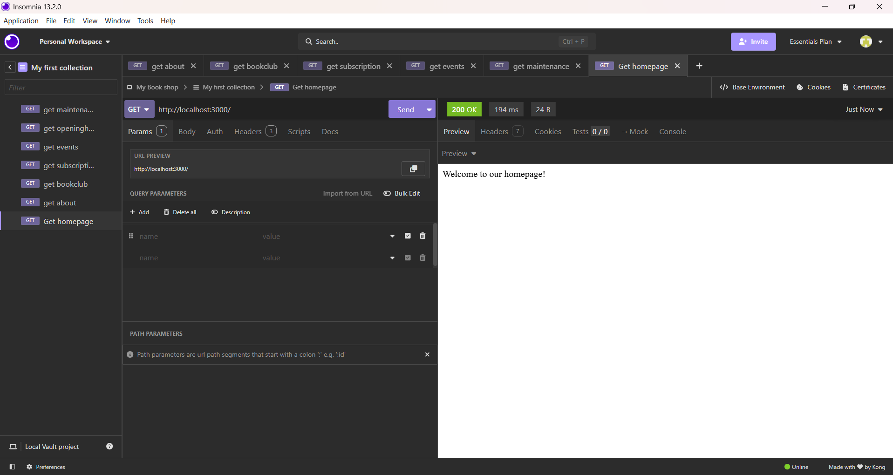
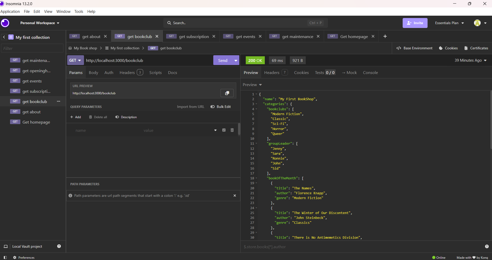
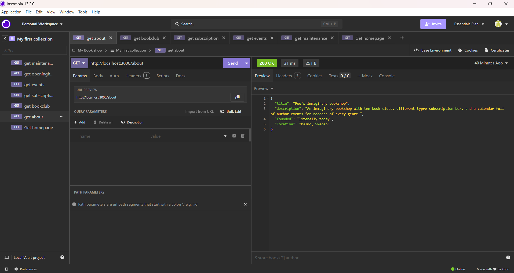
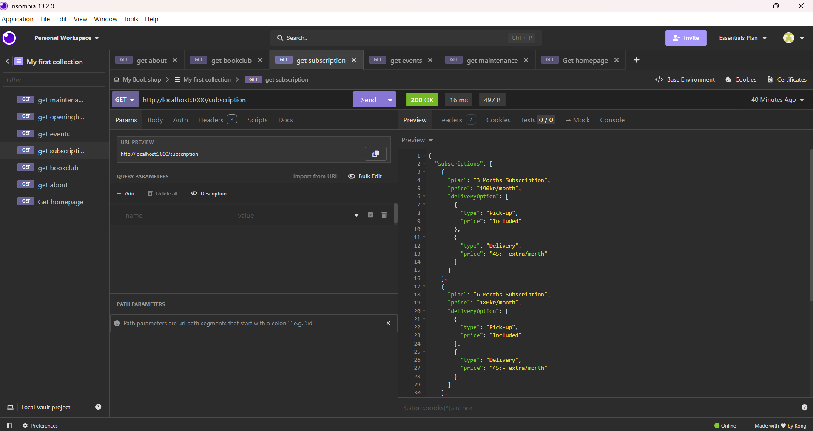
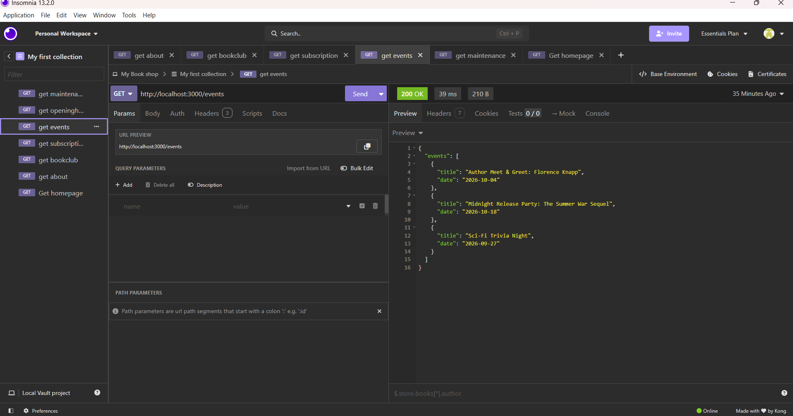
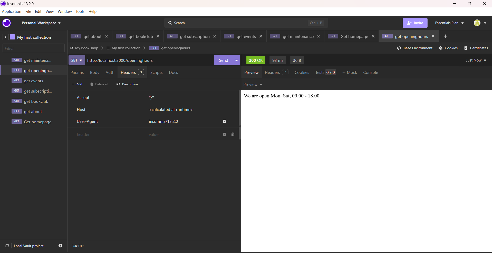
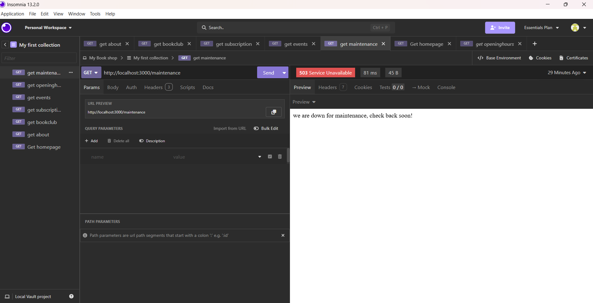

# Bookshop API

## Routes

### GET /
returns homepage
**Status code:** 200

### GET /bookclub
returns the bookclub object with the info regarding the bookclub
**Status code:** 200

### GET /about
returns a object with descriptive info about the shop
**Status code:** 200

### GET /subscription
returns a list of subricption available
**Status code:** 200

### GET /events
returns a list of upcoming bookshop events
**Status code:** 200

### GET /openinghours
returns a message with opening hours of the shop
**Status code:** 200

### GET /maintenace
returns a message in case of maintenace
**Status code:** 503

